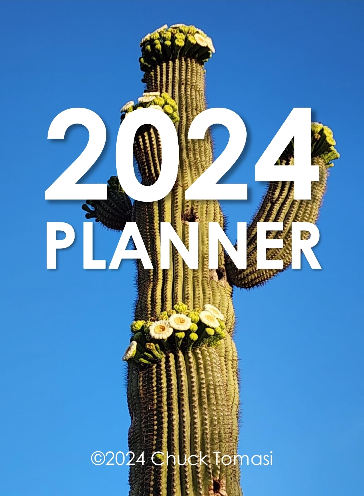

# e-ink-planners

This is my repository of planners designed to use on e-ink tablets. Files are organized in folders by hear. PDFs are available in two formats; files with "Monday" in the name have weeks that start on Monday. Similarly, files with "Sunday" in the name start on Sunday. These are free of charge and you may download the PowerPoint files and modify them to your own design.

## Device support

The PDFs provided here include clickable links for easy navigation through the months and days of the year. These have been tested on the following devices:

* reMarkable2
* Boox Note Air 2
* SuperNote A5X
* iPad with the Notably App
* Samsung phone with Samsung (PDF) Notes app

Please let me know if you have another and how your testing went. The PDFs are not intended for desktop use, but if they happen to work, 😀 to you!

## Creation Process

The PDFs were created a Mac using the desktop PowerPoint app, then opened in Office 365 in Chrome and downloaded as PDF. The local app provides internal document links and the Sharepoint operation preseves the links and formatting when creting the PDF.

## Disclaimer

The PDFs and their source PowerPoint files are provided free of charge and with no express warranty or support. I do this for personal organization and share it freely with the world.

## Change log

| Rev | Date | Description |
|-|-|-|
|1.0|2023-02-03|Intial release of 2023 files|
|1.1|2023-04-15|Created 2024 files. Added cover page and expanded tabs on month pages.|
|1.2|2023-09-16|Created 2025 files.|
|1.3|2023-09-19|Added photo covers.|

