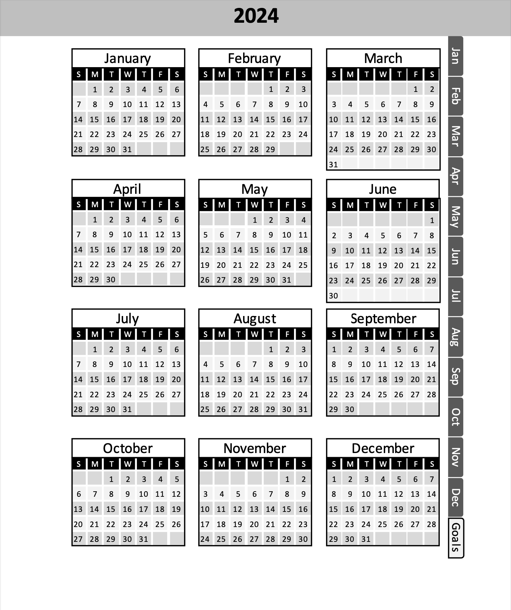

# e-calendars

This is my repository of calendars designed to use on e-ink tablets like reMarkable2, Super Note, and Boox.

## Device support

The PDFs include clickable links for easy navigtion through the months and days of the year. These have been tested on  reMarkable2 and Boox devices, but if you have another please let me know how it goes. The PDFs are not intended for desktop use, but if they happen to work, 😀 to you!

## Creation Process

The PDFs were created a Mac using the dedicated PowerPoint app, then opened through Office 365 in Chrome and downloaded as PDF. The local app provides internal document links and the Sharepoint operation preseves the links and formatting when creting the PDF.

## Disclaimer

The PDFs and their source PowerPoint files are provided free of charge and with no express warranty or support. I do this for personal organization and share it freely with the world.

## Change log

| Rev | Date | Description |
|-|-|-|
|1.0|2023-02-03|Intial release of 2023 files|
|1.1|2023-04-15|Created 2024 files. Added cover page and expanded tabs on month pages.|

